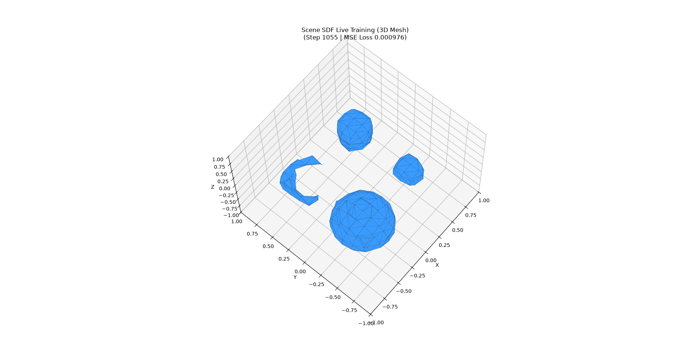
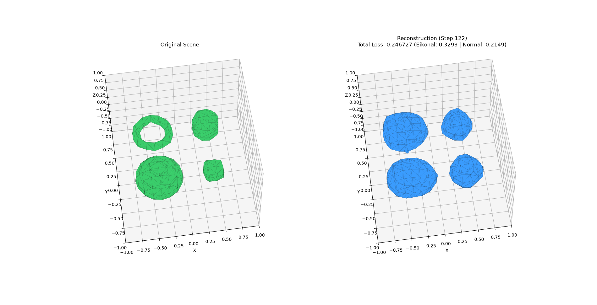
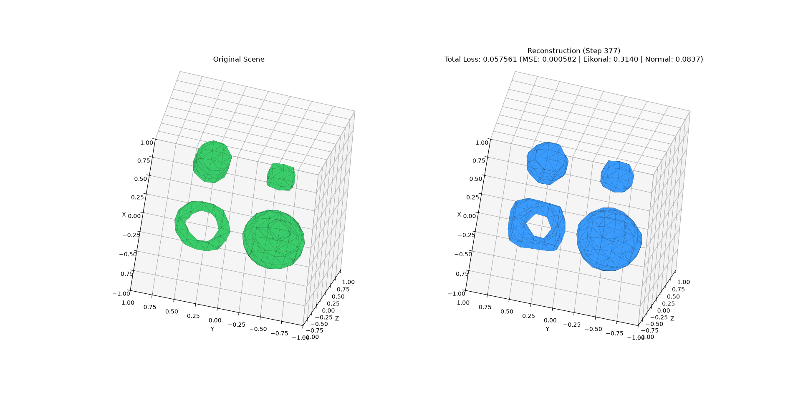

# SDFModel

**SDFModel** is a PyTorch research framework for learning, evaluating, and visualizing **Implicit Neural Representations (INR)** and **Signed Distance Fields (SDF)**. It integrates spatial Fourier feature embeddings, transformer cross-attention mechanisms over scene object tokens, and seamless integration with the `fogleman/sdf` engine for fast 2D slice sampling, 3D Marching Cubes isosurface mesh generation, live interactive training visualizations, and 3D STL/OBJ mesh exports.

<p align="center">
  
</p>

---

## 🌟 Training Visualization & Live 3D Scene Reconstruction

During training on multi-primitive 3D scenes (containing spheres, boxes, tori, and cylinders), `SceneTrainer` streams live 3D Marching Cubes isosurface reconstructions in real time.

### Live Training Progress & Reconstructions

#### 1. Initial Surface Formation (Step 1055 — MSE Loss: 0.000976)
Primitive boundaries (sphere, box, torus, capped cylinder) emerge from uniform and near-surface point sampling:

<p align="center">
  
</p>

---

#### 2. High-Frequency Surface Refinement (Step 2135 — MSE Loss: 0.000297)
High-frequency surface details refine as coordinate cross-attention grounds spatially onto learnable scene embeddings:

<p align="center">
  
</p>

---

#### 3. Final 3D Scene Isosurface Reconstruction
The network generates smooth, closed 3D isosurface meshes matching the ground truth 4-primitive scene:

<p align="center">
  
</p>

---

#### 4. Vector SDF Donut-Hole Failure (before fix)
The `VectorSDFModel` with an autograd-derived direction head failed to learn the torus rim interior (the donut hole). The learned direction head + chaos-game surface sampling fix this:

<p align="center">
  
</p>

---

#### 5. Accelerated Training Convergence
Coarse-to-fine Fourier band annealing + chaos-game surface sampling vs. uniform rejection sampling — faster convergence and better geometric fidelity:

<p align="center">
  
</p>

---

## Key Features

### Models

- **CrossAttnSDFModel (scalar SDF)**: Coordinate tokens cross-attend to learnable scene object token embeddings via `nn.MultiheadAttention` (batch_first, pre-norm LayerNorm). No self-attention over object tokens — only coordinate→object cross-attention. Shared backbone extracted into `_forward_features`; both `forward` (distance head) and `predict_scalar` reuse it.
- **VectorSDFModel (vector field)**: Extends `CrossAttnSDFModel` with a learned direction head: `v = normalize(vector_head(feats)) * dist_head(feats)`. Guarantees `|v| == |f|` by construction, provides first-order CPU-differentiable gradients (replaces dead autograd path), and enables direct direction supervision into the shared backbone via `compute_vector_sdf_loss`.
- **Scene Summary Token (`use_scene_token`)**: Opt-in learnable token prepended to object embeddings, giving coordinates a global scene context without breaking position invariance.
- **SDFMLP Baseline**: Flexible Multi-Layer Perceptron neural field with optional Fourier feature encodings, SiLU activations, and configurable `LayerNorm` / `WeightNorm` (via `parametrizations`).

### Fourier Positional Encoding

- **`FourierPositionEncoding`** supports static and learnable frequency bands.
- **Coarse-to-fine annealing**: `active_bands` ramps from `fourier_bands_start` (default 4) to `fourier_bands_end` over the first `fourier_anneal_fraction` (default 0.8) of training. Implemented as a smooth per-band ramp `weights = clamp(active_bands - arange(B), 0, 1)` — accepts float anneal values without hard slicing.

### Multi-Term SDF Loss & Metrics

- **`compute_combined_sdf_loss`** (scalar): distance (MSE + 0.5×L1), Eikonal, normal alignment.
- **`compute_vector_sdf_loss`** (vector): vector L2, cosine direction, magnitude MSE, Eikonal, normal alignment, and a **consistency loss** (predicted direction vs. finite-difference normals of the scalar field). Finite-difference normals are computed once and reused across terms.
- **Eikonal**: adaptive ε(p) directional finite differences (`eps = clamp(α·|f(p)|, ε_min, ε_max)`) — 1st-order CPU-differentiable, no autograd graph overhead. Exact autograd mode (`use_autograd=True`) available via `torch.autograd.grad`.

### Dataset & Sampling

- **`Scene4PrimitivesDataset`**: Generates 4-primitive scenes (sphere, box, torus, capped cylinder) with configurable sampling:
  - **Chaos-game sampler (default)**: Iterative surface projection — seed random particles, project onto the zero level set via the analytic SDF (`p ← p − f(p)·n̂(p)`), jitter for exploration, warm up, then emit. Dense surface coverage including thin structures (torus rim interior) that rejection sampling statistically misses. Parameterized by `chaos_iters` (default 4) and `chaos_jitter` (default 0.05).
  - **Rejection sampler (fallback)**: Uniform rejection inside the `surface_eps` band.
  - 50% near-surface / 50% uniform split by default; optional analytical surface normals via central finite differences.
- **`build_scene_dataloader`**: DataLoader factory forwarding all dataset parameters.

### Trainer

- **`SceneTrainer`**: Joint optimization of model + learnable embeddings with:
  - Coarse-to-fine Fourier band annealing (`_apply_fourier_anneal`).
  - Vector-model scalar-only warmup (`vector_warmup_steps`).
  - Per-term loss logging (`log_every_steps`) with detached scalar values.
  - Live `LiveSDFViewer` updates showing scalar and vector loss terms.

### Rendering & Export

- **`create_sdf3_wrapper`**: Wraps any model into `sdf.d3.SDF3` with automatic point batching (default 65536). Handles `CrossAttnSDFModel`, `VectorSDFModel` (via `predict_scalar`), and `SDFMLP`.
- **2D Slice** (`render_sdf_slice`): Fast cross-sections across X, Y, or Z planes.
- **3D Isosurface** (`render_sdf_3d`): Marching Cubes mesh extraction.
- **Mesh Export** (`export_sdf_mesh`): STL / OBJ export.
- **Interactive Interpolation** (`render_interactive_interpolation`): Matplotlib GUI with sliders for continuous embedding morphing; `export_interpolation_frames` produces animated GIFs.

### CLI & Scripts

- **`sdfmodel` CLI** (unified): `train`, `info`, `render`, `train-scene`, `eval-sdfmodel`.
- **`scripts/train_scene.py`**: Scene reconstruction with live viewer, checkpoint saving, STL export. Flags: `--model-type`, `--sampler`, `--chaos-iters`, `--fourier-bands`, `--use-scene-token`, `--vector-warmup`, `--log-every`, `--surface-eps`, `--num-tokens`.
- **`scripts/render_sdf.py`**: Model inference, slice/mesh rendering, STL export. Reconstructs model architecture from checkpoint flags (hidden_dim, num_layers, fourier_num_bands, use_scene_token, num_tokens).
- **`scripts/eval_sdfmodel.py`**: Interactive embedding interpolation GUI.

---

## 📁 Repository Structure

```text
SDFModel/
├── results/                                                        # Training & visualization outputs
│   ├── print_from_training_process_1.png                           # Live training 3D mesh snapshot (Step 1055)
│   ├── print_from_training_process_2.png                           # Live training 3D mesh snapshot (Step 2135)
│   ├── print_from_training_process_final_result_reconstruction.png # Final 3D scene reconstruction result
│   ├── current_vector_sdf_model_has_trouble_with_donut_hole.png    # Vector SDF donut-hole failure analysis
│   └── way_faster_training_results.png                             # Accelerated training results comparison
├── checkpoints/                                                    # Saved model checkpoints and output meshes
│   ├── scene_eval_test.pt
│   ├── test_scene_out.stl
│   ├── test_render.stl
│   └── best.pt
├── configs/
│   └── default.yaml          # Default experiment configuration (model, dataset, training)
├── scripts/
│   ├── train_scene.py        # Scene reconstruction training script with live viewer
│   ├── render_sdf.py         # Model inference, slice/mesh rendering, & STL export
│   └── eval_sdfmodel.py      # Interactive primitive embedding interpolation GUI script
├── src/sdfmodel/
│   ├── __init__.py           # Package init, version, CLI entry point
│   ├── cli.py                # Command-line entry points for `sdfmodel`
│   ├── render.py             # fogleman/sdf wrapper, Marching Cubes, & Matplotlib GUI
│   ├── datasets/
│   │   ├── __init__.py       # Dataset factory exports
│   │   ├── scene_sdf.py      # 4-primitive scene dataset (chaos-game & rejection sampling, normals)
│   │   └── spatial_sdf.py    # Synthetic 3D sphere SDF dataset generator
│   ├── engine/
│   │   ├── __init__.py       # Engine exports (Trainer, SceneTrainer, metrics)
│   │   ├── metrics.py        # SDF evaluation metrics (scalar + vector losses, Eikonal, normals)
│   │   ├── scene_trainer.py  # Joint trainer for CrossAttnSDF / VectorSDF + learnable embeddings
│   │   └── trainer.py        # Generic PyTorch trainer with AMP & metrics
│   ├── models/
│   │   ├── __init__.py       # Model registry (register_model, build_model, list_models)
│   │   ├── base.py           # Abstract BaseModel interface with device & param helpers
│   │   ├── cross_attn_sdf.py # Cross-attention SDF network (CrossAttnSDFModel, CrossAttentionTransformerBlock)
│   │   ├── fourier_pe.py     # Multi-frequency positional encoding with active_bands annealing
│   │   ├── sdf_mlp.py        # Baseline implicit neural field MLP
│   │   └── vector_sdf.py     # Vector SDF model with learned direction head
│   └── utils/
│       ├── __init__.py
│       ├── config.py         # Dataclass configuration schemas & YAML parser
│       └── seed.py           # Random seed reproducibility utilities
├── tests/                    # Behavioral pytest test suite (76 tests)
│   ├── __init__.py
│   ├── test_cross_attn_sdf.py
│   ├── test_datasets.py
│   ├── test_models.py
│   ├── test_render.py
│   ├── test_scene_dataset.py
│   ├── test_scene_trainer.py
│   ├── test_scene_trainer_vector.py
│   ├── test_trainer.py
│   ├── test_vector_enhancements.py
│   ├── test_vector_loss.py
│   ├── test_vector_render.py
│   └── test_vector_sdf.py
├── pyrefly.toml              # Pyrefly type checker configuration
├── pyproject.toml            # Package configuration and dependency declarations
└── README.md                 # Project documentation
```

---

## Installation & Setup

### Prerequisites
- Python ≥3.11, <3.14
- PyTorch 2.13+
- Linux (CPU-only; uses `pytorch` CPU index and PyG `torch-2.12.1+cpu` find-links)

### Installation via `uv` (Recommended)

```bash
# Clone repository
git clone https://github.com/your-username/SDFModel.git
cd SDFModel

# Install dependencies and sync virtual environment
uv sync
```

### Installation via `pip`

```bash
pip install -e .
```

---

## Quick Start & Usage

### 1. Scene Reconstruction Training

Train `CrossAttnSDFModel` or `VectorSDFModel` and learnable primitive embeddings to reconstruct a 3D scene containing a sphere, box, torus, and cylinder:

```bash
# Scalar SDF with live 3D mesh viewer, checkpoint saving, and STL export
python scripts/train_scene.py --model-type scalar_sdf --view 3d --epochs 10 --batch-size 2 \
    --save-checkpoint scene.pt --save-mesh scene.stl

# Vector SDF with scalar-only warmup, scene token, and Fourier band annealing
python scripts/train_scene.py --model-type vector_sdf --view 3d --epochs 10 \
    --use-scene-token --fourier-bands 8 --vector-warmup 2 --sampler chaos_game

# Chaos-game near-surface sampling with rejection fallback
python scripts/train_scene.py --sampler chaos_game --chaos-iters 4 --surface-eps 0.1
# or: --sampler rejection
```

Key flags:
| Flag | Default | Description |
|------|---------|-------------|
| `--model-type` | `scalar_sdf` | `scalar_sdf` or `vector_sdf` |
| `--hidden-dim` | 64 | Model hidden dimension |
| `--num-layers` | 4 | Transformer layers |
| `--num-tokens` | 8 | Learnable object token count |
| `--fourier-bands` | 8 | Fourier band count (annealed from 4) |
| `--use-scene-token` | off | Add learnable scene summary token |
| `--sampler` | `chaos_game` | Near-surface sampler: `chaos_game` or `rejection` |
| `--chaos-iters` | 4 | Chaos-game projection + jitter rounds |
| `--surface-eps` | 0.1 | Near-surface band half-width |
| `--vector-warmup` | 0 | Scalar-only warmup steps for vector model |
| `--log-every` | 10 | Print loss breakdown every N steps |

CLI equivalent:

```bash
sdfmodel train-scene --model-type scalar_sdf --view 3d --epochs 10 \
    --save-checkpoint scene.pt --save-mesh scene.stl
```

### 2. Model Rendering & Mesh Export

Render 2D slice cross-sections or extract 3D isosurface meshes from trained models. Checkpoint architecture flags (`hidden_dim`, `num_layers`, `fourier_num_bands`, `use_scene_token`, `num_tokens`) are read automatically:

```bash
# Render a 3D isosurface mesh and save to STL
python scripts/render_sdf.py --model cross_attn_sdf --checkpoint scene.pt \
    --view 3d --step 0.05 --output-mesh output_scene.stl

# Render a 2D slice along Z=0 plane at 256x256 resolution
python scripts/render_sdf.py --model sdf_mlp --view 2d --slice-axis z \
    --slice-pos 0.0 --resolution 256
```

CLI equivalent:

```bash
sdfmodel render --model cross_attn_sdf --checkpoint scene.pt --view 3d --output-mesh output_scene.stl
```

### 3. Interactive Primitive Embedding Interpolation

Launch the interactive GUI to interpolate scene primitive embeddings using real-time Matplotlib sliders:

```bash
python scripts/eval_sdfmodel.py scene.pt --view 3d --step 0.10
```

CLI equivalent:

```bash
sdfmodel eval-sdfmodel scene.pt --view 3d
```

### 4. Standard Model Training & Evaluation

Train baseline models (e.g., `SDFMLP`) configured via YAML:

```bash
# Train baseline model using CLI
sdfmodel train --epochs 5 --batch-size 64 --lr 0.001

# Display model info and registry details
sdfmodel info
```

---

## 🧪 Running Tests

Run the full behavioral pytest test suite:

```bash
uv run pytest
```

Or directly:

```bash
.venv/bin/python -m pytest tests/ -q
```

Current suite: **76 tests** covering model contracts, dataset sampling (chaos-game + rejection), trainer warmup/annealing/logging, vector loss terms (L2, cosine, magnitude MSE, Eikonal, normal, consistency), rendering wrappers, and CLI argument wiring.

---

## 📜 License

Distributed under the Apache 2.0 License. See `LICENSE` for details.
