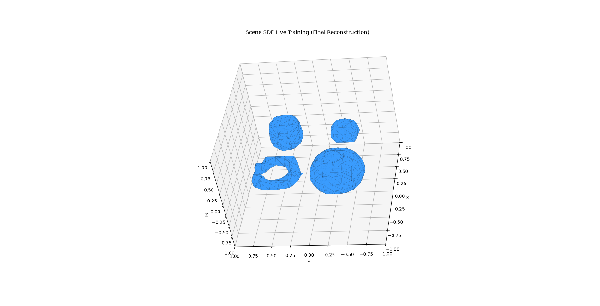
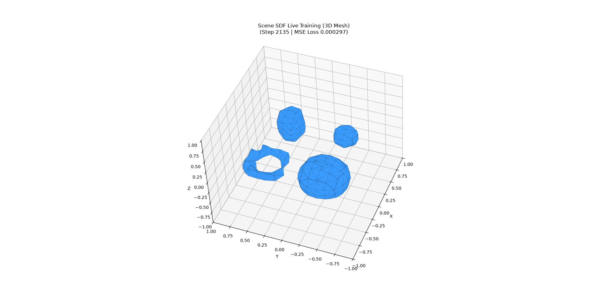

# SDFModel

**SDFModel** is a PyTorch framework for learning, evaluating, and visualizing **Implicit Neural Representations** and **Signed Distance Fields (SDF)**. It integrates spatial Fourier feature embeddings, transformer cross-attention mechanisms over scene object tokens, and seamless integration with the `fogleman/sdf` engine for fast 2D slice sampling, 3D Marching Cubes isosurface mesh generation, live interactive training visualizations, and 3D STL/OBJ mesh exports.

<p align="center">
  
</p>

---

## 🌟 Training Visualization & Live 3D Scene Reconstruction

During training on multi-primitive 3D scenes (containing spheres, boxes, tori, and cylinders), `SceneTrainer` streams live 3D Marching Cubes isosurface reconstructions in real time.

### 🖼️ Live Training Progress & Reconstructions

#### 1. Initial Surface Formation (Step 1055 — MSE Loss: 0.000976)
Primitive boundaries (sphere, box, torus, capped cylinder) emerge from uniform and near-surface point sampling:

<p align="center">
  
</p>

---

#### 2. High-Frequency Surface Refinement (Step 2135 — MSE Loss: 0.000297)
High-frequency surface details refine as coordinate cross-attention grounds spatially onto learnable scene embeddings:

<p align="center">
  
</p>

---

#### 3. Final 3D Scene Isosurface Reconstruction
The network generates smooth, closed 3D isosurface meshes matching the ground truth 4-primitive scene:

<p align="center">
  
</p>

---

## ✨ Key Features

- **CrossAttnSDFModel Architecture**: Combines Fourier positional encodings with transformer blocks featuring:
  - **Self-Attention**: Computes interactions across scene object token sequence embeddings.
  - **Cross-Attention**: Queries object embeddings using spatial 3D coordinate representations.
  - **Query Coordinate Chunking**: Automatic point chunking (`chunk_size`) prevents memory spikes during high-resolution isosurface mesh generation ($256^3$/$512^3$).
- **SDFMLP Baseline**: Flexible Multi-Layer Perceptron neural field model supporting optional Fourier feature encodings, SiLU activations, and configurable normalization layers (`LayerNorm` and `WeightNorm`).
- **Fourier Positional Features**: `FourierPositionEncoding` supports both static buffer frequency bands and learnable/adaptive frequency band scaling (`fourier_learnable`).
- **CPU-Differentiable & Autograd Eikonal Loss**: `compute_eikonal_loss` supports:
  - **Adaptive $\epsilon(p)$ Finite Differences**: Directional finite differences with adaptive step size scaling ($\epsilon(p) = \text{clamp}(\alpha |f(p)|, \epsilon_{\text{min}}, \epsilon_{\text{max}})$) enforcing $\|\nabla f\| = 1$ without autograd graph overhead.
  - **Exact Autograd Mode**: Optional exact gradient computation (`use_autograd=True`) via `torch.autograd.grad`.
- **fogleman/sdf Integration**: Converts PyTorch models into `sdf.d3.SDF3` interface objects via `create_sdf3_wrapper` with automatic point batching for:
  - **2D Slice Rendering**: Fast 2D cross-sections across X, Y, or Z planes (`render_sdf_slice`).
  - **3D Isosurface Mesh Extraction**: Marching Cubes mesh generation (`render_sdf_3d`).
  - **Mesh Export**: Export reconstructed scenes directly to STL or OBJ formats (`export_sdf_mesh`).
- **Live Training Viewer**: `LiveSDFViewer` provides non-blocking, thread-safe 2D or 3D Matplotlib visual updates across interactive and headless backends.
- **Interactive Embedding Interpolation & GIF Export**: `render_interactive_interpolation` launches a Matplotlib GUI with sliders for continuous shape blending, while `export_interpolation_frames` renders and exports smooth embedding morphing animations as stack arrays or animated GIFs.
- **Unified CLI & Scripts**: Modular command-line interface (`sdfmodel`) and specialized standalone scripts for scene training, rendering, and evaluation.

---

## 📁 Repository Structure

```text
SDFModel/
├── print_from_training_process_1.png                            # Live training 3D mesh snapshot (Step 1055)
├── print_from_training_process_2.png                            # Live training 3D mesh snapshot (Step 2135)
├── print_from_training_process_final_result_reconstruction.png  # Final 3D scene reconstruction result
├── configs/
│   └── default.yaml          # Default experiment configuration
├── scripts/
│   ├── train_scene.py        # Scene reconstruction training script with live viewer
│   ├── render_sdf.py         # Model inference, slice/mesh rendering, & STL export
│   └── eval_sdfmodel.py      # Interactive primitive embedding interpolation GUI script
├── src/sdfmodel/
│   ├── cli.py                # Command-line entry points for `sdfmodel`
│   ├── render.py             # fogleman/sdf wrapper, Marching Cubes, & Matplotlib GUI
│   ├── datasets/
│   │   ├── scene_sdf.py      # 4-primitive scene dataset (near-surface & uniform sampling)
│   │   └── spatial_sdf.py    # Synthetic 3D sphere SDF dataset generator
│   ├── engine/
│   │   ├── scene_trainer.py  # Joint trainer for CrossAttnSDF & learnable embeddings
│   │   ├── trainer.py        # Generic PyTorch trainer with AMP & metrics
│   │   └── metrics.py        # SDF evaluation metrics (MSE, PSNR, L1, Eikonal)
│   ├── models/
│   │   ├── cross_attn_sdf.py # Transformer Cross-Attention SDF network architecture
│   │   ├── sdf_mlp.py        # Baseline implicit neural field MLP
│   │   ├── fourier_pe.py     # Multi-frequency positional encoding
│   │   └── base.py           # Abstract model interface with device & param helpers
│   └── utils/
│       ├── config.py         # Dataclass configuration schemas & YAML parser
│       └── seed.py           # Random seed reproducibility utilities
├── tests/                    # Behavioral pytest test suite (34 tests)
├── pyproject.toml            # Package configuration and dependency declarations
└── README.md                 # Project documentation
```

---

## ⚙️ Installation & Setup

### Prerequisites
- Python 3.10+
- PyTorch 2.0+

### Installation via `uv` (Recommended)

```bash
# Clone repository
git clone https://github.com/your-username/SDFModel.git
cd SDFModel

# Install dependencies and sync virtual environment
uv sync
```

### Installation via `pip`

```bash
pip install -e .
```

---

## 🚀 Quick Start & Usage

### 1. Scene Reconstruction Training

Train `CrossAttnSDFModel` and 4 learnable primitive embeddings to reconstruct a 3D scene containing a sphere, box, torus, and cylinder:

```bash
# Run training with live 3D mesh viewer, checkpoint saving, and STL export
python scripts/train_scene.py --view 3d --epochs 10 --batch-size 2 --save-checkpoint scene.pt --save-mesh scene.stl
```

Alternatively, use the unified CLI:

```bash
sdfmodel train-scene --view 3d --epochs 10 --save-checkpoint scene.pt --save-mesh scene.stl
```

### 2. Model Rendering & Mesh Export

Render 2D slice cross-sections or extract 3D isosurface meshes from trained models or un-trained initializations:

```bash
# Render a 3D isosurface mesh and save to STL
python scripts/render_sdf.py --model cross_attn_sdf --view 3d --step 0.05 --output-mesh output_scene.stl

# Render a 2D slice along Z=0 plane at 256x256 resolution
python scripts/render_sdf.py --model sdf_mlp --view 2d --slice-axis z --slice-pos 0.0 --resolution 256
```

CLI equivalent:

```bash
sdfmodel render --model cross_attn_sdf --view 3d --output-mesh output_scene.stl
```

### 3. Interactive Primitive Embedding Interpolation

Launch the interactive GUI to interpolate scene primitive embeddings using real-time Matplotlib sliders:

```bash
python scripts/eval_sdfmodel.py scene.pt --view 3d --step 0.10
```

CLI equivalent:

```bash
sdfmodel eval-sdfmodel scene.pt --view 3d
```

### 4. Standard Model Training & Evaluation

Train baseline models (e.g., `SDFMLP`) configured via YAML files:

```bash
# Train baseline model using CLI
sdfmodel train --epochs 5 --batch-size 64 --lr 0.001

# Display model info and registry details
sdfmodel info
```

---

## 🧪 Running Tests

Run the full PyTorch behavioral test suite using `pytest`:

```bash
uv run pytest
```

---

## 📜 License

Distributed under the Apache 2.0 License. See `LICENSE` for details.
